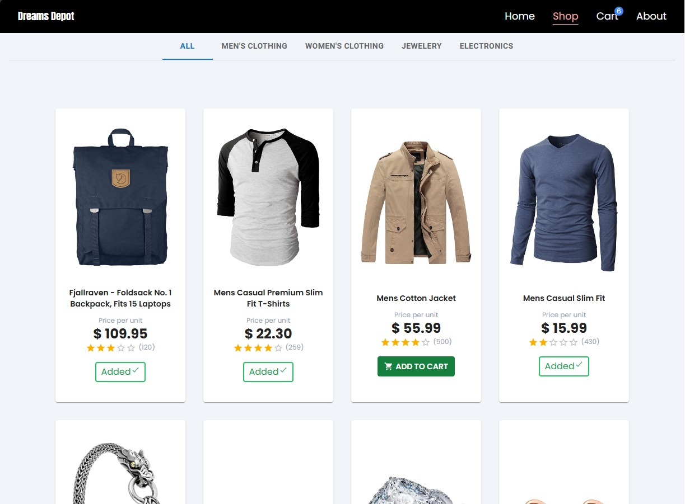

# Fictional Online Store

This is a fictional online store built with Vite, React, Redux, TypeScript, and Tailwind CSS. The live preview is available [here](https://shopping-cart-ts-wine.vercel.app/).

<p>
  <a href="https://github.com/JosueDeLosSantos/shopping-cart-ts.git"></a>
</p>

## Table of Contents

-   [Features](#features)
-   [Installation](#installation)
-   [Usage](#usage)

## Features

-   **Modern Frontend Stack**: Built with Vite, React, Redux, and TypeScript.
-   **Styling**: Tailwind CSS for fast and responsive design.
-   **State Management**: Redux for managing application state.
-   **Type Safety**: TypeScript for static type checking.
-   **Responsive Design**: Optimized for various screen sizes.
-   **Live Preview**: Check out the live preview [here](https://shopping-cart-ts-wine.vercel.app/).

## Installation

1. **Clone the repository**:

    ```bash
    git clone https://github.com/JosueDeLosSantos/shopping-cart-ts.git
    cd shopping-cart-ts
    ```

2. **Install dependencies**:

    ```bash
    npm install
    ```

3. **Start the development server**:
    ```bash
    npm run dev
    ```

## Usage

-   **Development**: Run `npm run dev` to start the development server.
-   **Build**: Run `npm run build` to build the project for production.
-   **Preview**: Run `npm run preview` to preview the production build.
